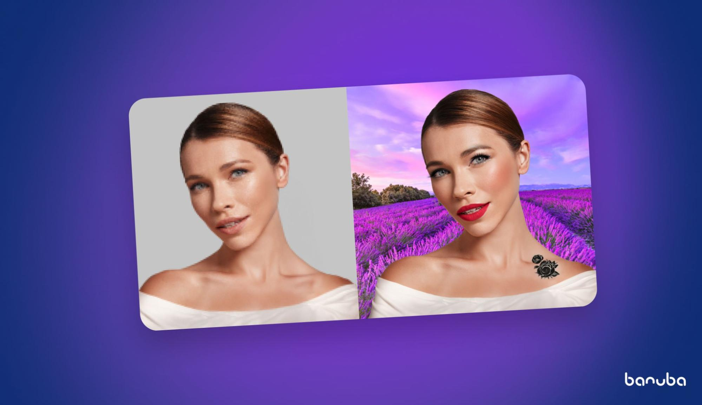

This repository contains code samples for implementing [Banuba Face AR SDK for Android](https://www.banuba.com/augmented-reality-sdk). 
It covers various applications, from applying face and [hand AR](https://www.banuba.com/technology/hand-tracking-and-gesture-recognition) 
effects to integrating with [Agora.io](http://Agora.io) SDK for video calls.

Face AR SDK is a multipurpose toolkit for integrating augmented reality features and effects. Its main features include:

* Beauty effects
* Virtual makeup
* Virtual backgrounds
* Face masks
* Virtual nail polish & fake nails
* Color filters
* Avatars
* Etc.

It is designed to increase development velocity, increase user engagement, and boost app downloads.

Banuba Face AR SDK doesn’t collect, store, or process any user data, making it secure by design and compliant with GDPR and 
other data protection regulations. It is also flexible, allowing you to choose only the features that you need, 
optimizing your budget and app size.

## [Requirements](https://docs.banuba.com/far-sdk/tutorials/capabilities/system_requirements)

## Usage
### Token
Before you commit to a license, you are free to test all the features of the 
SDK for free. To start it, 
[send us a message](https://www.banuba.com/facear-sdk/face-filters#form). We 
will get back to you with the trial token. You can store the token within the 
app.  

Feel free to [contact us](https://docs.banuba.com/far-sdk/support) if 
you have any questions.

### Getting Started

1. Clone the repository
2. Copy and Paste your client token into appropriate section of 
[`common/src/main/java/com/banuba/sdk/example/common/Application.kt`](common/src/main/java/com/banuba/sdk/example/common/Application.kt#L5)
3. Open desired project in Android Studio and run it

## Examples for integrating [Banuba SDK on Android](https://docs.banuba.com/far-sdk/tutorials/development/basic_integration?platform=android).  

This repository contains the following examples:   
- [`camera`](camera/) apply effect to stream from camera and show it on the screen,  
- [`video_processing`](video_processing/) apply effect to video from the app assets,  
- [`video_recording`](video_recording/) apply effect to video from camera and record video,
- [`avatar`](avatar/) customizable avatar effect (see comments in code how to change the avatar),
- [`beauty`](beauty/) basic sample how to aply beauty, this sample can be used for medical application too,
- [`hands`](hands/) set of samples related to hands (rings, watch, gestures etc.),  
- [`videocall`](videocall/) demonstrates Agora.io SDK integration to enable augmented reality filters in video calls.

Please, note, that individual samples may contain own `README` files. Consider them.

### Docs
You can find more info 
[here](https://docs.banuba.com/far-sdk/).
